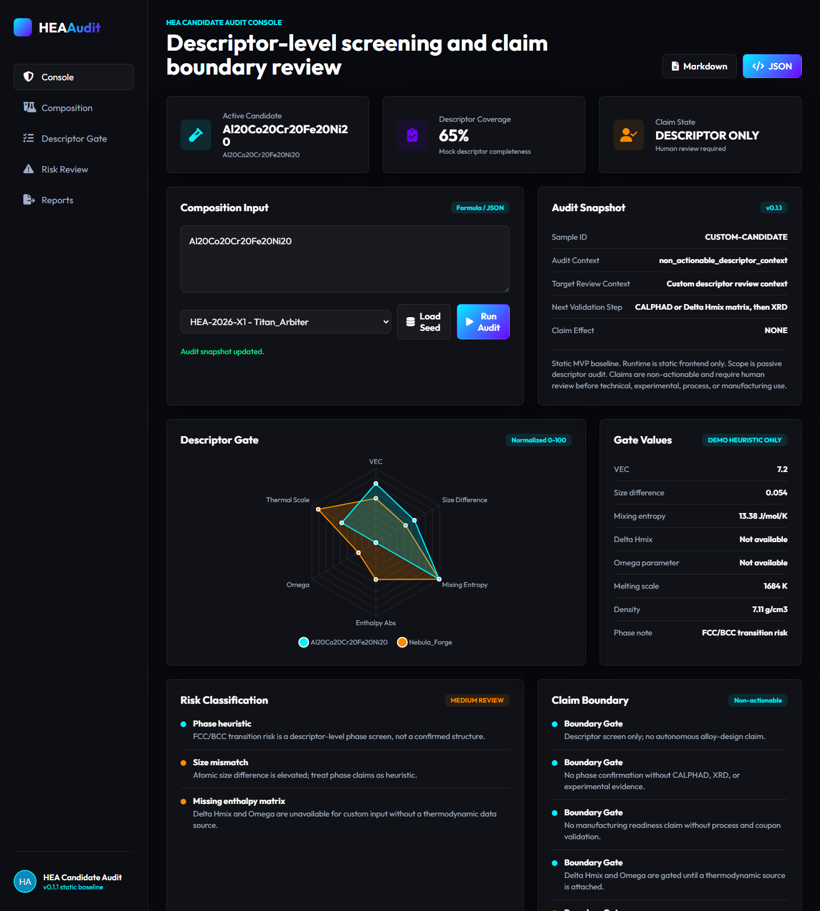

# HEA Candidate Audit Console v0.1.1

Static MVP baseline for passive high-entropy alloy candidate auditing.

## Baseline Status

```text
Status: STATIC_MVP_BASELINE
Runtime: STATIC_FRONTEND_ONLY
Scope: PASSIVE_DESCRIPTOR_AUDIT
Claims: NON_ACTIONABLE_HUMAN_REVIEW_REQUIRED
```

## Preview



## Demo Status

This repository is currently prepared for static local use.

A GitHub Pages deployment may be enabled later as a public preview, but the current project remains a static MVP baseline and does not provide experimental validation, production readiness, or autonomous material recommendations.

## What It Does

- Accepts alloy composition input such as `Al20Co20Cr20Fe20Ni20`.
- Computes or displays descriptor-level values for VEC, size difference, mixing entropy, melting scale, density, Delta Hmix, and Omega.
- Classifies review risks such as size mismatch, phase-heuristic uncertainty, missing thermodynamic matrix data, and low-VEC regions.
- Separates descriptor coverage from literature, experimental, process, and manufacturing evidence.
- Exports JSON or Markdown audit snapshots for human review.

## What It Does Not Do

- It does not confirm material phases.
- It does not establish manufacturing readiness.
- It does not replace CALPHAD, XRD, SEM-EDS, hardness tests, magnetic tests, or coupon-level review.
- It does not produce autonomous technical claims.

## Who this is for

This project is intended for:

- HEA / MPEA researchers reviewing early-stage candidate screening workflows
- Materials informatics engineers designing audit-oriented scientific software
- Labs or small R&D teams exploring passive pre-screening report concepts
- Technical reviewers interested in claim-boundary-safe AI/materials demos

## Who this is not for

This project is not designed for users looking for:

- automatic alloy invention
- validated material property prediction
- production-ready alloy recommendations
- replacement of CALPHAD, XRD, SEM-EDS, or physical testing
- autonomous manufacturing, procurement, or deployment decisions

## File Set

```text
index.html
index.css
app.js
data.js
README.md
DISCLAIMER.md
TECHNICAL_BRIEF_v0_1_1.md
```

## Local Use

Open `index.html` directly, or serve the folder with any static web server.

```powershell
npx serve .
```

The current build uses external CDN assets for Chart.js, FontAwesome, Google Fonts, and avatar rendering. A later offline asset patch can localize those dependencies.
